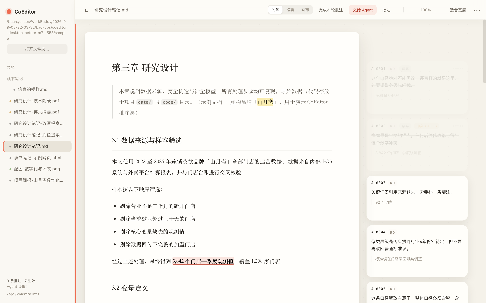
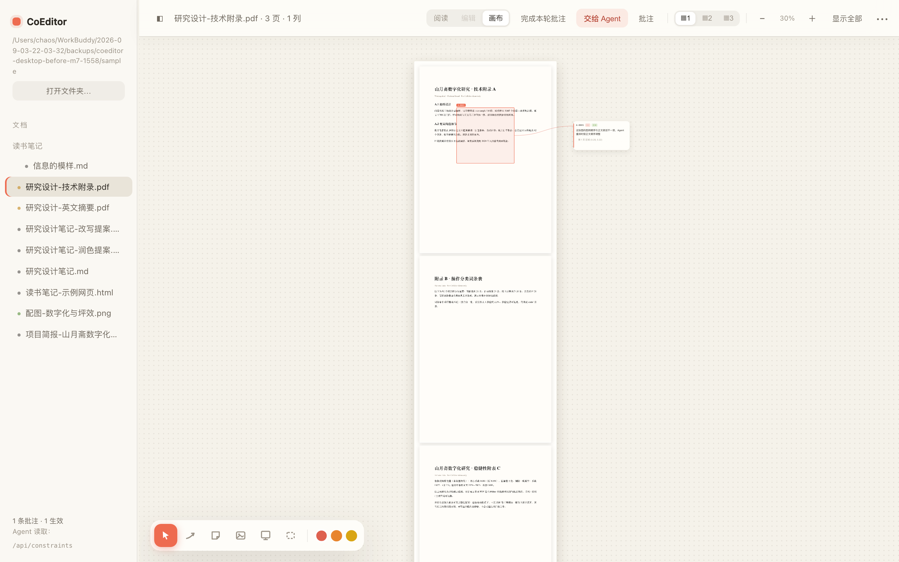
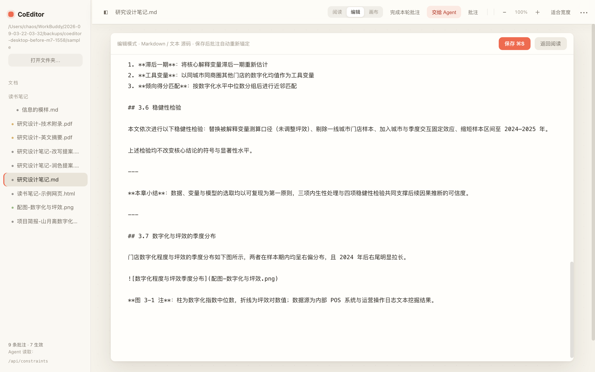

# CoEditor · v1.3.2

<p align="center">
  
</p>

CoEditor 是一层覆盖在本地文件夹上的网页阅读、编辑、批注与 **AI 改稿验收**界面。它把人的反馈保存成可追溯、可交给 Agent 的结构化约束；Agent 改完稿登记新版本，人在渲染后的双栏对照里验收或退回。保持普通文档工具的直觉：先阅读，需要时编辑，图片工作才进入画布。





## 现在能做什么

- 打开本机文件夹：macOS 使用原生系统文件夹选择器；左侧按 VS Code 的折叠树浏览，侧栏可拖动调整宽度。
- 阅读 Markdown、TXT、HTML、JSON、CSV、PDF、DOCX 和常见图片。HTML 保留原布局在隔离 iframe 中呈现（不执行脚本，外链资源默认阻断）；PDF 使用官方 pdf.js 渲染与文字层（HiDPI、按需绘制、失败页可重试）。
- 编辑 Markdown、TXT、HTML、JSON、CSV：进入「编辑」后使用 CodeMirror，支持语法着色、行号、撤销与搜索；`⌘S` 写回原文件（保存前 mtime 乐观锁，外部改动会被拒绝而非盲目覆盖）。HTML 还支持阅读态双击纯文本段落直接修改。**PDF/DOCX/PPTX 为只读预览**：修改走批注 → Agent 改稿 → 版本验收。
- 选中文字后使用「批注 / 保留 / 删除线」。其中「保留」表示这段内容很好，Agent 修改时不得删除或改写；正文只显示黄底，不额外牵引一根线。
- 批注按 `批次-序号` 编号，例如第 0 批次依次为 `0-1、0-2、0-3`；点「完成本轮批注」后进入第 1 批次。外部文件变化只重新锚定，不擅自推进批次。
- 在「批注」中按批次查看历史。当前条目用绿点提示，已处理、过期或移除的条目淡化；普通批注可编辑、删除，「保留」可取消。
- 悬停任一侧即点亮其余侧：抽屉条目、画布卡、正文里被批注的文字、区域框四者联动，鼠标移开即复位。
- 接入 MCP 的 Agent 处理完批注会调用 `resolve_annotations` 把条目标记为「已回应」。注意：这是 Agent 的声明，用户在版本对照里验收后才算数。
- 图片与 PDF 可框选区域写批注；图片可导出烧录了区域框与编号的标注图，再交给 Agent 改图。
- 画布保留必要的三类动作：选择/平移、手绘箭头、贴图，以及 PDF 区域框选。便签与白板已从界面移除。
- 通过 URL、HTTP、CLI 或 MCP 让 Agent 读取当前约束。图片新版本可作为图卡放回画布，不覆盖原图。
- 「把修改指令交给 Agent」（••• 菜单）：把当前批注与画布箭头汇总成一份可执行的修改指令，复制粘贴、或**存成 `.md` 放进当前目录**（`<文档名>-修改指令.md`）让有目录读权限的 Agent 自己读。同名自动加 `-2/-3`，绝不覆盖已有文件。
- **改稿验收闭环**：Agent 改完稿调用 MCP `register_version` 登记新版本（新文件放原稿旁边，原件不动），「版本对照」Tab 会显示**渲染后的双栏对照**与汇总（回应了几条反馈、保留内容是否完好）；确认无误点「验收」，不满意点「退回」——被退回的那批回应会重新变回待处理。原稿被改动的登记会被哈希校验拦下，防止验收错对象。
- **「保留」跨版本持续有效**：继续在新版本上批注时，服务端自动把上一版生效中的保留要求带到新文件；原文在新稿里找不到的会明确标「缺失待确认」，不静默假装成功。
- 右栏「大纲」按正文标题导航（Markdown/HTML）；「反馈栏」可一键折叠；顶栏常驻「已保存到本地」状态。

## 安装与启动

需要 Node.js 18 或更新版本，无需 `npm install`。

```bash
git clone https://github.com/DHLbigmonster/CoEditor.git
cd CoEditor
node cli.mjs open ./sample
```

默认地址是 `http://127.0.0.1:4400`。也可以直接指定自己的文件夹与端口：

```bash
node cli.mjs open ~/Documents/thesis --port 4401
```

作为全局命令使用：

```bash
npm link
coeditor open ~/Documents/thesis
```

文档具有可寻址 URL：

```text
http://127.0.0.1:4400/?doc=研究设计笔记.md
```

## 三种工作模式

### 阅读

默认模式。文档按可读宽度纵向展开，滚轮行为与普通网页一致；批注卡在正文右侧同屏出现。选中文本会弹出「批注 / 保留 / 删除线」。

### 编辑

Markdown、TXT、HTML、JSON、CSV 可直接修改。保存前使用 mtime 乐观锁：如果文件已被别的工具修改，CoEditor 会拒绝盲目覆盖。



### 画布

用于图片与空间标注。空白处拖动平移；图卡拖动只移动图卡本身，不会带动画布。底部工具条固定居中：

- `V`：选择 / 平移
- `A`：拖画箭头，松手后输入标签；过短手势自动取消
- `I`：选择、拖入或粘贴图片成为图卡
- `R`：在 PDF 页上框选区域
- `Delete`：删除选中的箭头、图卡或草稿卡

## 批注与批次

每条批注同时保留内部技术 ID 与面向人的显示号。界面和 Agent 指令只展示 `0-1` 这类显示号，内部 ID 只用于兼容已有 sidecar 与 API。

状态含义：

- 当前：本轮修改需要遵守
- 已处理：已经回应，保留在历史中
- 已过期：原文锚点失效，仅供追溯
- 已移除：不再作为当前要求，但仍留在历史中

用户明确点击「删除」时允许物理删除；写盘前会把旧 sidecar 轮转到 `.marginalia/annotations.json.prev`，便于恢复。其他任何无原因的集合数量减少仍会被防破坏守卫拒绝。

批注定位使用 `quote + prefix + suffix` 上下文。文档变化后会模糊重定位；找不到时标为过期，不把它继续当作当前约束。

## Agent 读取

CLI：

```bash
node cli.mjs constraints ./sample 研究设计笔记.md
node cli.mjs constraints --json ./sample 研究设计笔记.md
node cli.mjs conflicts ./sample 研究设计笔记.md
```

HTTP：

```bash
curl "http://127.0.0.1:4400/api/constraints?p=研究设计笔记.md"
```

MCP：

```bash
claude mcp add coeditor -- node /absolute/path/CoEditor/mcp-stdio.mjs /absolute/path/vault
```

主要工具：`list_documents`、`read_document`、`list_annotations`、`get_active_constraints`、`get_annotation_context`、`get_canvas_state`、`get_ui_state`、`insert_asset`、`insert_canvas_image`、`insert_html_draft`。

`kind=highlight` 是历史字段名，产品语义已固定为「保留」：Agent 必须原样保留对应内容。

## 数据与安全

- 所有批注与画布状态保存在 `<vault>/.marginalia/annotations.json`，源文档不会被转移到 CoEditor 私有数据库。
- sidecar 使用临时文件 + rename 原子写；每次覆盖前保留 `.prev`。
- 读取失败时拒绝写入，避免把空结构覆盖真实批注。
- 导出文件名会消毒，阻止路径越界。
- 服务只监听 `127.0.0.1`，定位为单用户本地工具。
- 旧版便签/白板数据仍留在 sidecar 以向后兼容，但界面、Agent 约束和 Canvas 导出均不再呈现它们。

## 验证

```bash
node tools/run-battery.mjs
```

测试会复制 `sample` 到临时目录并启动隔离端口，不写仓库演示数据或用户文件。当前 13 套浏览器 E2E + 11 项后端契约回归覆盖：真实输入选区/保留/编辑、PDF 区域与长文档按需渲染、HTML 直改、版本对照闭环（按 id 验收/哈希核对/服务端保留继承/退回边界）、修改指令落盘、批注互链、多 vault 记录等。发布门禁 13/13。

## 品牌资产

设计文件在 `docs/logo/`（历史暖橙渐变版本）：界面主色已转为 ChatGPT 式中性黑白灰（强调色 `#0d0d0d`），logo 保留可替换：

- `logo.svg` 主标（方案 B「画布选区」）；`logo-white.svg` 深底用；`logo-a.svg` / `logo-c.svg` 为备选留档，随时可换
- `icon-light.svg`（浅底）/ `icon-orange.svg`（橙底 App Icon）
- PNG：`logo-512/128/32/16.png`、`icon-512/180/32.png`
- 网页 favicon 由 `public/favicon.svg`（PNG 兜底 `favicon.png`）提供

## 暂不做

- 直接编辑 PDF 内容：由 Agent 生成新版本放在原文件旁边。
- DOCX 二进制内联写回：当前支持阅读、选区和批注。
- PPTX 原生渲染：当前建议先转 PDF 或图片。
- 多页 Slides 与 AI 占位框：不属于当前“直觉阅读与批注”的核心闭环。
- 语义级冲突判定：当前只根据锚点重叠提示冲突。

更多版本记录见 [CHANGELOG.md](CHANGELOG.md)，开发交接见 [docs/HANDOFF.md](docs/HANDOFF.md)。
