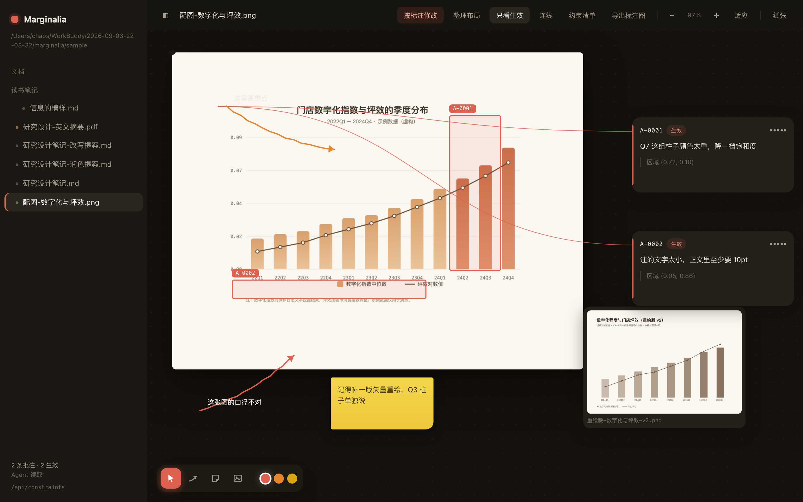

# Marginalia · v0.4.0（M1 / M1.5 / M2 / M3 / M4 全部完结）

零依赖（只用 Node 内置模块 + 原生前端），画布式本地文档批注层：人在网页上写字，批注按原文位置落锚、永不删除，Agent 改文档时自动重定位，批注作为**约束**回流给 Agent。**M4 起，画布交互对齐 Cowart（手绘标注箭头 / 便签 / 贴图 / 一键按标注修改）。**



## 安装 / 启动

```bash
# 方式一：clone 后直接跑（推荐，零依赖）
git clone <repo> marginalia && cd marginalia
node cli.mjs open ./sample          # 默认 http://127.0.0.1:4400
node cli.mjs open ~/Documents/thesis --port 4401

# 方式二：作为全局命令（需 node ≥ 18）
npm link
marginalia open ~/Documents/thesis

# 方式三：一次性跑（发布到 npm 后可用 npx）
npx marginalia open ~/Documents/thesis
```

深链直达文档（Agent 可直接打开）：

```
http://127.0.0.1:4400/?doc=研究设计笔记.md
```

交互：拖拽空白处平移画布 · 触控板捏合 / ⌘+滚轮缩放 · 选中文本即批注 · 点卡片跳回原文 · 「整理布局」自动排列卡片 · 「只看生效」聚焦 active 批注 · 「连线」降噪（仅悬停/选中的批注显示牵引线）。切文档时地址栏同步 `?doc=`，支持前进后退与分享。

## 画布工具（M4 · Cowart 交互层）

左下角工具条（快捷键 `V` 选择 / `A` 箭头 / `N` 便签 / `I` 贴图，`Esc` 回选择，`Delete` 删除选中项）：

- **手绘标注箭头**：按住拖画 → 松手即成。自动微弯（`bend = clamp(len×0.12, 16, 48)`）、手绘抖动笔触、拖太短（<8px）自动取消、**建完立即写标签**。三色限定（红/橙/黄），双击改字，端点可拖重画，整体可平移。
- **便签**：点击画布放置，双击编辑，独立于批注编号体系（想法随手记，不入约束）。
- **贴图到画布**：选文件 / 直接拖图进画布 / ⌘V 粘贴截图 → 成为画布上的自由图卡，可拖动；点「打开批注」进入批注模式框选区域。
- **按标注修改**（顶栏按钮）：任意文档/图片 → 自动导出标注图（图片文档）+ 组装完整修改指令（目标文件 + 逐条约束 + 标注图路径 + 完成核对要求）→ 一键复制给任何 Agent。

箭头与便签存 sidecar 顶层 `arrows[] / notes[]`，**按文档归属**（切文档互不干扰），与批注同为纯 JSON 可 git 管理。

## Agent 双向通道（M4 · 对齐 Cowart MCP 能力面）

| Cowart | Marginalia 对应 |
|---|---|
| `get_cowart_canvas_state` | `get_canvas_state` — 画布全貌（箭头/便签/图卡/草稿卡，可按文档过滤） |
| `get_cowart_selection` | `get_ui_state` — 人当前打开的文档与选中的元素（网页实时上报） |
| `insert_cowart_image` | `insert_canvas_image` — 把生成的新版本图作为图卡放到画布（永不覆盖原图） |
| `insert_cowart_html_draft` | `insert_html_draft` — 单文件 HTML 草稿卡（iframe 沙箱渲染，相对图片路径自动改写） |
| `save_cowart_canvas_state`（防破坏） | `insert_asset` + sidecar 防破坏守卫（任一集合数量无故减少即拒绝写盘） |

Agent 放的产物刷新网页即见；人双击图卡进批注模式，形成「人标注 → Agent 改 → 新版本放旁边 → 人再批注」的完整循环。

**约束的完整口径**：`get_active_constraints` / `constraints` CLI / 约束清单抽屉 / 「按标注修改」指令，四处输出同源——生效批注 + 手绘箭头标签 + 便签文本（按文档归属过滤）。冲突警告只算双方仍生效的（对方 deprecated = 已裁定，不再骚扰）。sample 目录里的 `研究设计笔记-改写提案.md` 是一次真实演练的产物：独立写作 Agent 只靠 CLI 读约束完成改写，遵守了「样本量勿引用」「46% 含税口径需重算」两条批注，并把结果写到新文件而非覆盖原文。

## Agent 侧读取约束（三种方式）

```bash
# 1. CLI
node cli.mjs constraints ./sample 研究设计笔记.md
node cli.mjs constraints --json ./sample 研究设计笔记.md
node cli.mjs conflicts ./sample 研究设计笔记.md     # 未裁定冲突

# 2. HTTP
curl "http://127.0.0.1:4400/api/constraints?p=研究设计笔记.md"

# 3. MCP（Claude Code / Codex 等）
claude mcp add marginalia -- node /abs/path/marginalia/mcp-stdio.mjs /abs/path/vault
# 工具：list_documents / read_document / list_annotations /
#       get_active_constraints（修改前必调）/ get_annotation_context /
#       list_annotation_exports（取标注图）/ insert_asset（产物入 vault）/
#       get_canvas_state（画布全貌）/ get_ui_state（人的当前文档与选中）/
#       insert_canvas_image（新版本图入画布）/ insert_html_draft（HTML 草稿卡）
```

## 图片批注（M3）

1. 文件树中打开 png/jpg/… → 在图上**框选区域** → 写批注（region 归一化坐标）。
2. 点工具栏「导出标注图」→ 区域框 + 编号烧录进图，存 `<vault>/.marginalia/exports/`。
3. 右侧抽屉自动生成给 Agent 的修改指令（源图 + 标注图 + 逐条批注与坐标），一键复制。
4. Agent 改图请**产出新版本放旁边**——旧图与旧批注原地保留，永不删除。

## PDF 批注（M3）

- PDF.js 只读渲染（vendor：`public/vendor/pdfjs/`，pdfjs-dist 6.3.289），canvas 页面 + 自建透明文本层。
- 文本可直接选中批注，锚定/降权/冲突机制与 md 完全一致。

输出示例：

```
# 研究设计笔记.md · 生效批注 1 条

[A-0005] w=1.00
  位置：「外卖业务板块的净利润为46%」
  要求：这条口径我改主意了：整体口径必须含税，含税口径下这块业务的利润率要重新算。
```

## 已实现

- 本地文件夹 → 网页文件树（md / txt / html / json / csv / **pdf** / **图片**）
- 内置极简 markdown 渲染（不联网、无 CDN）
- 选中文本 → 生成批注卡：编号 `A-0001` 递增，**永不删除**
- 贝塞尔牵引线连接高亮处与卡片；卡片可拖动，位置持久化
- 状态机：`active → addressed → stale → deprecated`，权重随状态衰减
- **模糊重定位**：quote 找不到 → 退化为前 24 字 → 再退化为 prefix+quote；多处命中时用 prefix/suffix 上下文打分消歧（重复句不再钉错位置）；仍找不到自动标 `stale` 并权重 ×0.5
- **外部修改感知**：轮询 mtime，Agent 改文档后自动重渲染并重新锚定批注
- **URL 可寻址**：切文档同步地址栏 `?doc=`，支持前进/后退，链接可直接发给 Agent
- **安全加固**：sidecar 原子写（tmp+rename 防截断）· 导出文件名消毒防路径越界 · HTML 渲染剥离 `<script>`
- **矛盾检测**：新批注与旧批注锚定同一处原文（重叠 ≥60%）→ 双向标记冲突徽标，点「以此为准」完成 supersedes 裁定，被替代者转为废弃但**保留在案**
- **约束清单抽屉**：一键复制全部生效约束为 Markdown，直接粘给任何 Agent
- **PDF 只读渲染 + 文本批注**（PDF.js vendor，自建文本层供锚定）
- **图片区域批注 + 标注图导出 + Agent 指令生成**
- **文档内嵌图片批注（M1.5）**：md 中 `` 渲染为图卡，可直接在图上框选区域批注；批注带 `image` 字段指向源图，Agent 经 MCP/CLI 可定位到具体图片文件
- **Obsidian Canvas 导出**：`node cli.mjs canvas <vault> [doc]` 生成 `<doc>.canvas`（JSON Canvas 1.0 spec），批注即画布卡片，可直接拖入 Obsidian 二次批注
- **手绘标注箭头 + 便签 + 贴图（M4）**：Cowart 同款画布交互，箭头 bend 常量组与「建完即编辑」手感 1:1 移植
- **防破坏保存**：任何写盘瞬间批注总数减少即拒绝（`blocked-destructive-annotation-loss`），批注物理不可删
- 批注存 sidecar：`<vault>/.marginalia/annotations.json`（纯 JSON，可 git 管理）

## 未实现（后续候选）

- 冲突的语义级判定（当前基于锚点位置重叠，不判断内容语义）
- DOCX / EPUB 支持（PRD 已明确排除）
- 多页画布 / Slides / AI 生成占位框（Cowart 有但**有意不做**：依赖 Codex widget 生态或超出批注层定位；画布元素按文档归属已覆盖多页场景）

## 已知限制

- `.html` 文件注入前剥离 `<script>`，但事件属性（onclick 等）未消毒——仅用于本地可信文档；HTML 草稿卡用 iframe `sandbox="allow-scripts"`（无 same-origin）隔离
- 锚点基于纯文本匹配，极长文档（>10 万字）索引为 O(n²)，需后优化
- 单用户、无鉴权，仅绑定 127.0.0.1
- MCP 与 server 为两个进程，各自带防破坏守卫但无文件锁——单人本地使用无碍，勿多端同时写同一 vault
