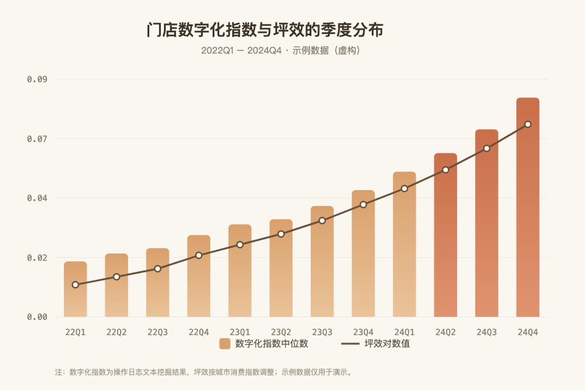

# 第三章 研究设计

> 本章说明数据来源、变量构造与计量模型。所有处理步骤均可复现，原始数据与代码存放于项目 `data/` 与 `code/` 目录。（示例文档 · 虚构品牌「山月斋」，用于演示 CoEditor 批注层）

## 3.1 数据来源与样本筛选

本文使用 2022 至 2025 年连锁茶饮品牌「山月斋」全部门店的运营数据，数据来自内部 POS 系统与外卖平台结算报表，并与门店台账进行交叉核验。

样本按以下顺序筛选：

- 剔除营业不足三个月的新开门店
- 剔除当季歇业超过三十天的门店
- 剔除核心变量缺失的观测值
- 剔除数据回传不完整的加盟门店

经过上述处理，最终得到 **3,842 个门店—季度观测值**，覆盖 1,208 家门店。

## 3.2 变量定义

### 被解释变量

门店坪效（Sales per Sqm），采用季度营收除以营业面积测算，并按城市消费水平指数调整。相较原始营收，调整后坪效能缓解区域价格差异带来的选择问题。

### 核心解释变量

门店数字化程度（Digital），由门店数字化运营操作日志中数字化工具相关事件占全部操作事件的比重度量。操作分类表涵盖智能排班、自动补货、线上订单聚合、会员运营四个维度，共 92 个词条。

### 控制变量

- 门店规模（Size）：营业面积自然对数
- 人力配置（Staff）：当季平均在岗人数
- 会员渗透率（Member）
- 门店年龄（Age）：开业时长加一取对数
- 商圈类型（Zone）：写字楼 / 住宅 / 学校
- 城市线级（Tier）
- 加盟 vs 直营（Mode）

## 3.3 模型设定

本文构建如下双向固定效应模型：

```
Sales_it = α + β · Digital_it + γ · Controls_it + μ_i + λ_t + ε_it
```

其中 μ_i 为门店固定效应，λ_t 为季度固定效应，标准误在门店层面聚类调整。β 的符号与显著性是本文关注的核心。

## 3.4 描述性统计

样本期内，数字化程度均值为 0.0548，中位数为 0.0371。均值显著大于中位数，说明样本分布右偏：多数门店数字化水平较低，少数标杆门店的投入显著高于体系平均。

门店净利润率均值为 11.6%，其中外卖业务板块的净利润为46%，远高于门店整体水平。该高毛利板块对整体利润贡献超过三成，是后续异质性分析的重点。

## 3.5 内生性处理

本文采用三种方式缓解内生性：

1. **滞后一期**：将核心解释变量滞后一期重新估计
2. **工具变量**：以同城市同商圈其他门店的数字化均值作为工具变量
3. **倾向得分匹配**：按数字化水平中位数分组后进行近邻匹配

## 3.6 稳健性检验

本文依次进行以下稳健性检验：替换被解释变量测算口径（未调整坪效）、剔除一线城市门店样本、加入城市与季度交互固定效应、缩短样本区间至 2024—2025 年。

上述检验均不改变核心结论的符号与显著性水平。

---

**本章小结**：数据、变量与模型的选取均以可复现为第一原则，三项内生性处理与四项稳健性检验共同支撑后续因果推断的可信度。

---

## 3.7 数字化与坪效的季度分布

门店数字化程度与坪效的季度分布如下图所示，两者在样本期内均呈右偏分布，且 2024 年后右尾明显拉长。



**图 3-1 注**：柱为数字化指数中位数，折线为坪效对数值；数据源为内部 POS 系统与运营操作日志文本挖掘结果。
